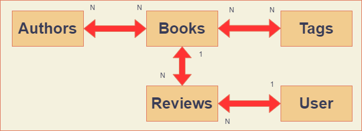

# rest-data-sample
Simple rest web service with spring boot. Library with books, authors, reviews, users and tags.
<ul>
  <li><a href="src/main/java/rest/data/sample/authors/">Authors controller</a> <b>"/library/authors"</b> 
  </li>
   
</ul>
# entity relationship model

# tests
 <ul>
      <li><a href="src/test/java/rest/data/sample/AuthorsControllerTests.java">Authors controller test</a></li>
      <li><a href="src/test/java/rest/data/sample/BooksControllerTests.java">Books controller test</a></li>
</ul>
